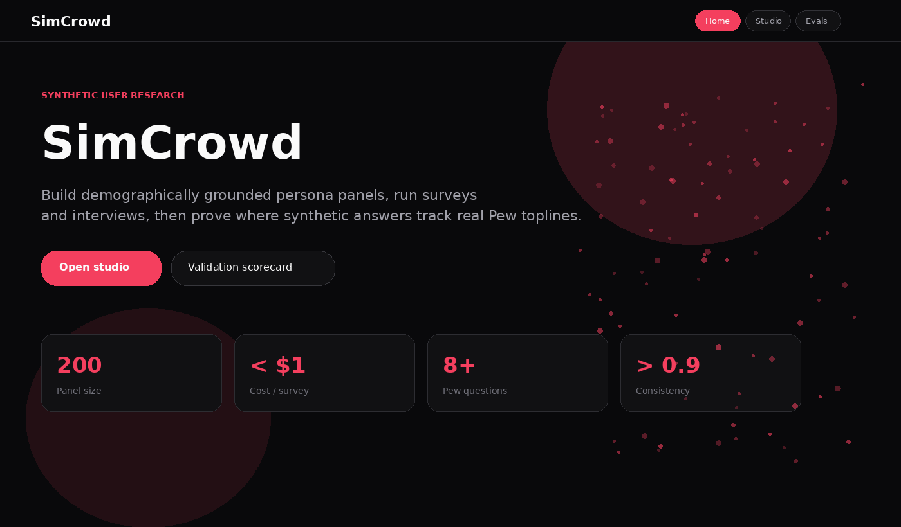
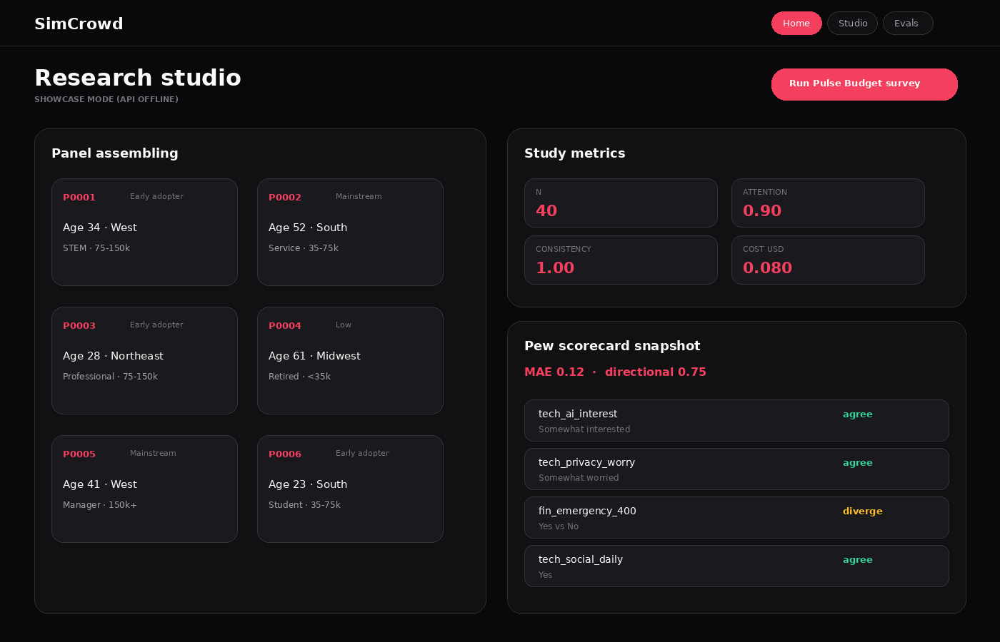
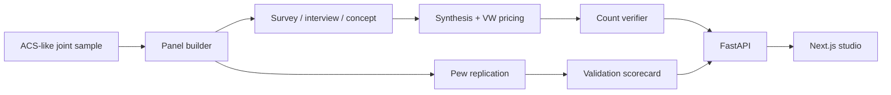

# SimCrowd

Synthetic user research platform with **Pew reality validation**.

Give SimCrowd a product concept or questionnaire and it builds a demographically grounded panel from ACS-like joint distributions, runs surveys / interviews / concept tests, synthesizes a cited research report, then scores the panel against published Pew toplines. The validation scorecard is the product differentiator: where synthetic respondents track reality, and where they diverge.

> Status: M1-M3 shipped for GitHub showcase. Offline LLM mode (`SC_OFFLINE_LLM=1`) keeps CI and Pages demos free of API keys.

## Live website

**https://h3xobit.github.io/simcrowd/**

Public showcase (landing, studio, evals). The studio runs in showcase mode when the FastAPI backend is not hosted. Clone and run `make demo` on another machine for the full live stack.

## Headline validation story

| Metric | What it means |
| --- | --- |
| Panel max marginal error | ACS-like joint sample realism (gate: <= 3pp on key demographics) |
| Consistency rate | Persona-consistent answers on first/resample path (CI gate: >= 0.9) |
| Report verification | Cited insight counts recomputed from raw responses |
| Pew mean MAE / directional agreement | Synthetic vs published toplines (reported honestly, including misses) |
| Cost per study | Offline estimate for a cheap-model fan-out (target: 200 personas under $1 live) |

CI smoke: 20-persona mini-panel, unit tests, Next.js build, compose health + study, eval harness.

## What it does

1. **Samples whole person records** (weighted) from a bundled ACS-like microdata cache so age/income/education/region stay jointly realistic.
2. **Writes personas** with seeded backstories and attitude tags.
3. **Runs research** in parallel: closed surveys (option shuffle + attention check), 5-turn laddering interviews, concept tests.
4. **Synthesizes** segmented insights, objection themes, and Van Westendorp pricing (pandas math only).
5. **Verifies** every cited count against raw responses.
6. **Validates** against Pew topline CSVs transcribed into `data/pew/`.
7. **Serves** FastAPI (`/panels`, `/studies`, `/reports/{id}`, `/scorecard`) and a Next.js studio UI.


## Preview





## Architecture



## Quickstart (other machine / CI only)

Host ports stay high on purpose:

| Service | Host port |
| --- | --- |
| Web UI | 23000 |
| API | 28000 |
| Postgres | 25432 |

```bash
cp .env.example .env
make setup
make demo
```

Then:
- UI: `http://localhost:23000/app`
- API docs: `http://localhost:28000/docs`

### Tests and evals

```bash
make test
python evals/run_evals.py --smoke 20
```

## Data notes

- Bundled `data/census/sample.jsonl` keeps demos offline. Optional live pull: `python data/download_census.py`.
- Pew: only derived topline CSVs are committed. See `data/pew/README.md`.
- Demo concepts: fintech, meal-kit, developer tool under `data/concepts/`.

## Why this project is interesting

- Joint-distribution sampling instead of independent demographic draws
- Position-bias controls and attention checks built into the runner
- Numbers never come from the LLM (VW + segment counts are pandas)
- Reality validation published as a first-class product surface

## License

MIT
